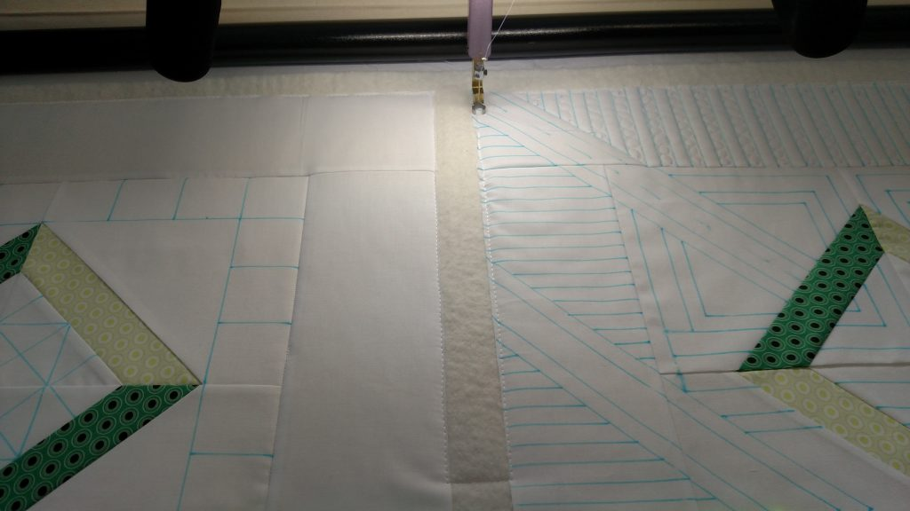
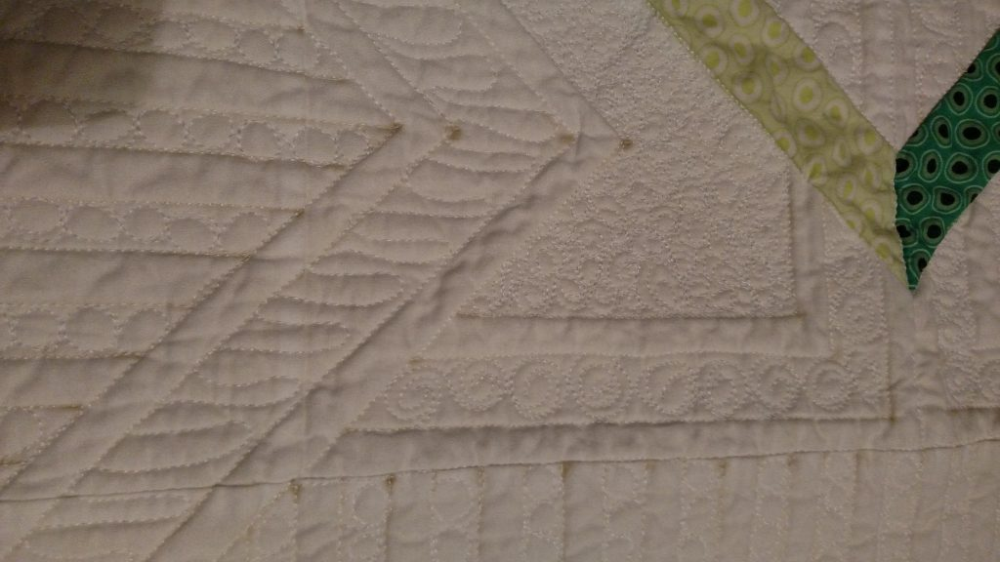
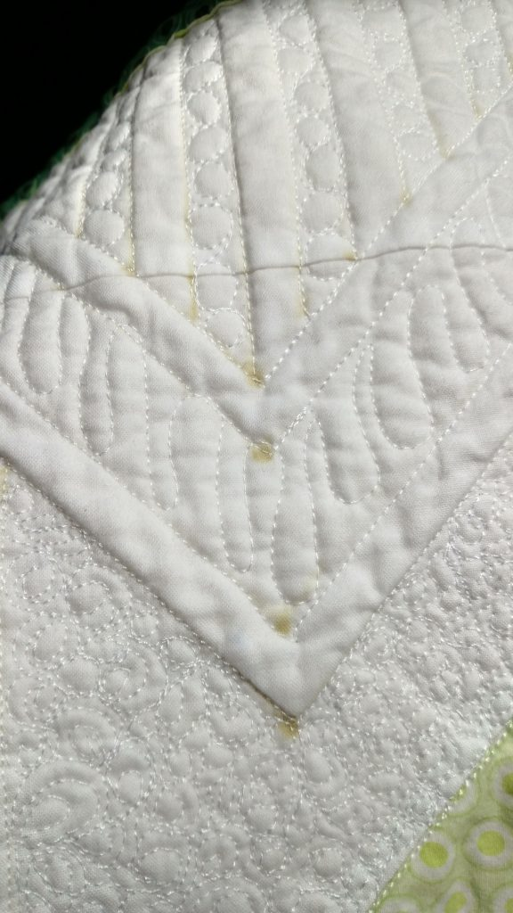
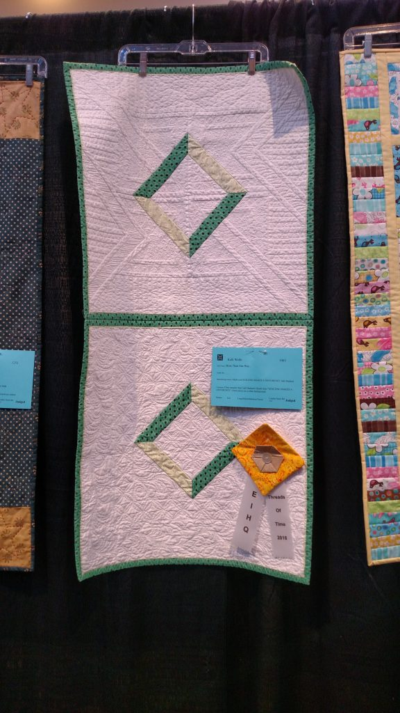

## Blue Marking Pen 
Blue marking pens are the standard marking tool in quilting. They are not the only one,  
just the one I see used most often. Especially for light fabrics. This is my project after  
watching Judi Madsen's iQuilt class 

Lots of blue marking and ready to quilt. As I was quilting, I would "spritz" the marks to  
get a better idea of what the quilting really looked like at the end of the session. I noticed  
that the next day the marks returned. Usually a little more spread out, but still there. This should  
have been a warning to me.

There are several different ways to get marks out. Washing is not one of them! I know this because  
I **“assumed”** washing was the same as rinsing. Because, well, washing starts by putting water  
on the quilt, right?? Turns out washing is NOT the same as rinsing. Washing the blue marks off  
resulted in ugly brown spots at all of the intersections. The lighter marks did get rinsed off,  
but the heavily marked intersections got washed “into” the quilt.

I read a lot of potential fixes on the web and tried a lot of them. I stopped short of bleach,  
I wasn’t ready to go there, even though the fabric was white. I tried prolonged soaking, Oxyclean, Dawn, even Shout.

I finally found a blog that recommended “that stuff”. It was my last hope before using bleach. 
Good news: it worked!! And just in time for me to enter it in my guild show where it received a ribbon. Success!

