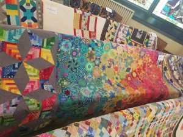

# English Paper Piceing
JULY 29, 2017 BY KELLI

To Millefiori or not, that is the question. Or rather, dilemma, for me. They are so cool and I want one of my own.

Before I get into the rest of this post I want to explain the more generic version of what I’m talking about: [English Paper Piecing](https://www.allpeoplequilt.com/how-to-quilt/piecing/how-to-english-paper-piecing) (EPP). EPP is done in a way that allows for very tiny pieces and very sharp points in a design made with fabric. This technique involves wrapping fabric around stiff paper pieces and then stitching the pieces together. Sounds tedious, right? Sometimes I really like the tiny work, it’s a nice contrast to the huge long arm work.

[Millefiori](https://en.wikipedia.org/wiki/Millefiori) means “thousand flowers” and I knew it from glass designs in jewelry and vases. Then [Willyne Hammerstein](https://www.facebook.com/profile.php?id=100009286557018) became famous with her fabric interpretation. Search the web for [Millefiori or La Passacaglia](https://www.google.com/search?q=Millefiori+or+La+Passacaglia+quilt+images&rlz=1C5CHFA_enUS724US727&tbm=isch&tbo=u&source=univ&sa=X&ved=0ahUKEwj-qf_vwKzVAhVB1oMKHWGzC70QsAQIKQ&biw=1112&bih=612)
for amazing images (Milly and La Pas for short), they are amazing! (I don’t want to post any pictures for fear of copyright issues.) Next came [Katja Marek](https://www.facebook.com/katja.marek) with her [Glorious Hexagon revolution](https://www.facebook.com/groups/1632627283681156/) and a simplified way to do the [Millefiori](https://www.katjasquiltshoppe.com/quilt-alongs/the-new-hexagon-millefiore-quilt-along/).

I’ve always been drawn to intricate designs and details. I especially like detailed designs when they are combined with bright colors. And color progressions? I’m in heaven. This one made me swoon!

I had the privilege of quilting my neighbor’s Glorious Hexagon top and it was a bit nerve racking. I kept thinking of the number of hours she put into making the top. I was afraid of ruining it…then what would I do?? I could never recreate it! There are over 300 hexagons and some of them have as many as 24 pieces! That’s crazy!

Good news: after procrastinating for over a month, I finally “just went for it”.  

I was relieved when the first pass was completed and it looked good.

To be honest you don’t really notice the quilting, so I shouldn’t have been so nervous. The colors on this quilt and the thousand of pieces are the star of the show.

Her quilt even got viewer’s choice at her guild’s show. It is so beautiful and I was so excited to be able to quilt it for her. I didn’t want to give it back. 🙂

So, back to hand piecing…I like to do hand work, especially when I’m not able to use my long arm. And English Paper Piecing is very small and portable. Bonus: I could take part of it when I travel, which I’ve been doing a lot lately. So, I should do one, right? Oh, wait. I have one last block of a 12 month appliqué BOM that I’ve been meaning to finish….apparently for 6 years now…at least that’s what [Facebook](https://www.facebook.com/kelli.wolfe.12/posts/1834493669911211) reminded me of recently.

I should probably finish that, right? But Katja’s latest quilt along is a smallish [Hex-plosion](https://www.katjasquiltshoppe.com/product-category/hex-plosion/) piece that is starting in a few days. Wouldn’t that be fun? Too many projects and too little time.

Enjoy the Journey!
