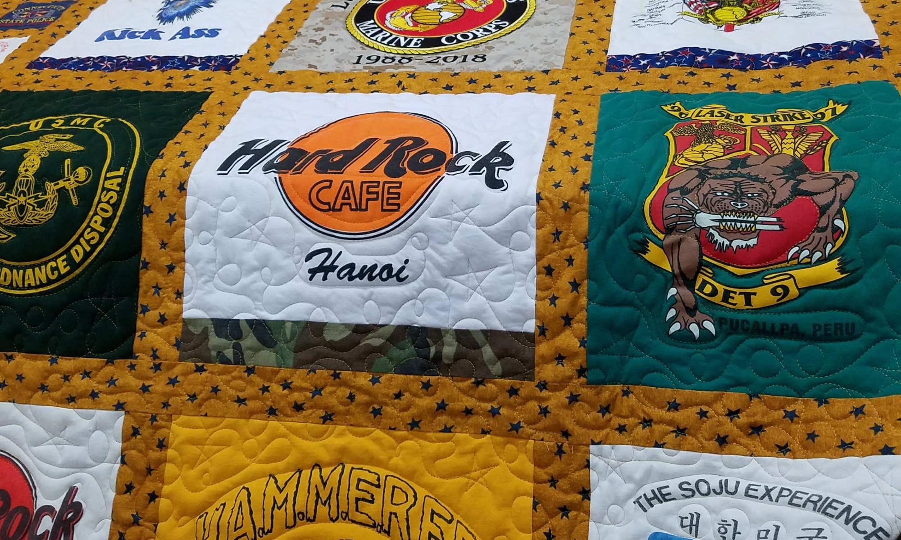
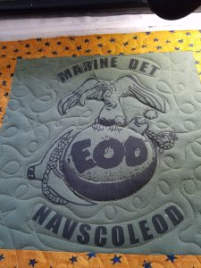
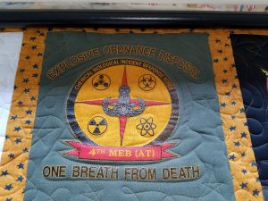
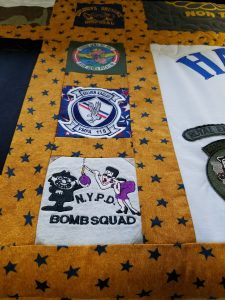
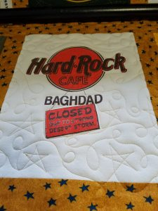

# Marine T-Shirt Quilt
APRIL 18, 2017 BY KELLI

A few weeks ago I had the honor of quilting a t-shirt quilt for a retiring US Marine.  
T-shirt quilts are my favorite thing to quilt; it’s like taking a brief walking through another persons life.

He was a part of several “explosive ordinance disposal” (EOD) units. Apparently that  
group’s motto is “one breath from death”. Just a little humbling to think he spent  
most of his career in that line of work for our country.

This t-shirt quilt caused me to do a lot of reflecting on what his life may have been  
like and I said more than one prayer of gratitude for his service. What an amazingly  
brave man he must be. And to survive 30 years in that field, he had to be very good at his job!  
Seems like he even “moonlighted” in that same line of work. Amazing.

Fun fact: He got one of the best Hard Rock Cafe T-shirts ever!

What an amazing life this man has had and he’s seen a lot of the world. I was so honored to have contributed to this quilt.
