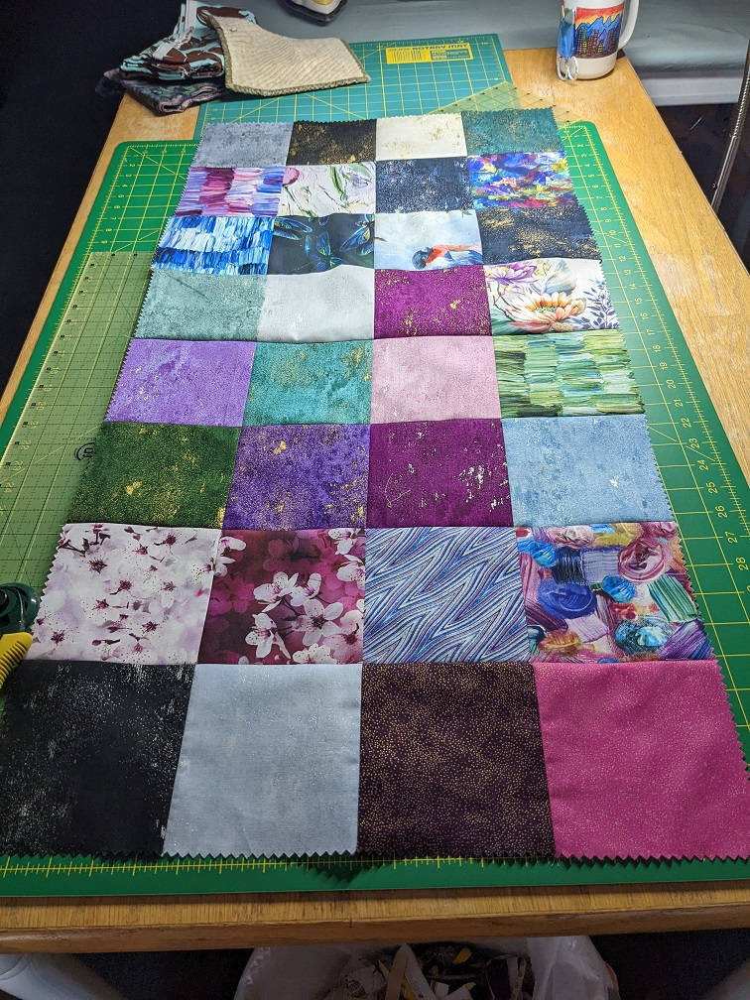
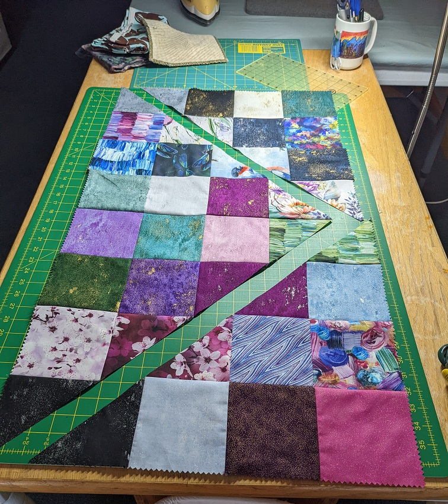
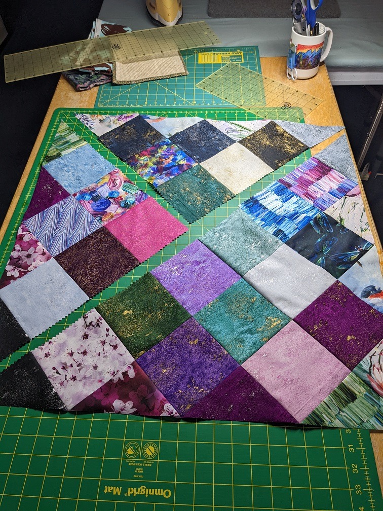

# On point
FEBRUARY 9, 2022 BY KELLI

I'm putting this up here so I don't have to search for it when I need an easy on point quilt. The only drawback to this technique is it makes a square quilt. Which isn't bad, but often we want more of a rectangle for beds. I need to play with it more to determine if I can use this technique to make a rectangle....someday. 

You start by sewing all of the squares together into a long rectangle that is twice as long as it is wide. 

Next you cut from one corner to the center and repeat on the bottom. 

Now you rotate the smaller triangles around and wha-la, you have an on point square. 

