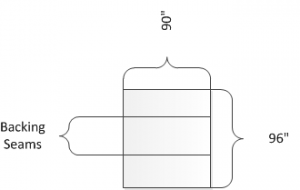

## QUILT BACKING
This page gives some tips for quilters about how to prepare their backing for  
quilting on a longarm machine. Some of these things are specific to me and  
my machine, but the rest should apply to most quilters.

Backings with no seams are fantastic! [Helios](https://heliosstitchesnstuff.com/t/helios-quilt-backs) (my favorite quilt shop)  
has many to choose from and they can ship directly to you. The best way to prepare  
this type of  backing for your quilter is to pre-wash it. I personally recommend  
washing in warm water and drying  on medium to remove the sizing.

If you want to use up the rest of the fabric you bought then you'll be piecing the backing.  
The easiest for the longarmer is to have the seams going horizontal to the rollers.  
Vertical seams will cause bulk to accumulate as the quilt is rolled up and that bulk can cause odd puckering.

The  maximum width I can currently handle on my frame is a 120 inch top. Piece the backing so  
that it is 94 inches wide and 102 inches long with the pieced seams running the shorter length.  
In general, a quilter needs 6-8 extra inches in length for attaching to the rollers.  
I'm using the equivalent of "red snappers" and they require the extra fabric to go under the snappers  
on the top and bottom of the quilt backing. Ideally we also like to have 6-8 extra inches wide  
so there is room to maneuver if the top isn't completely square.
