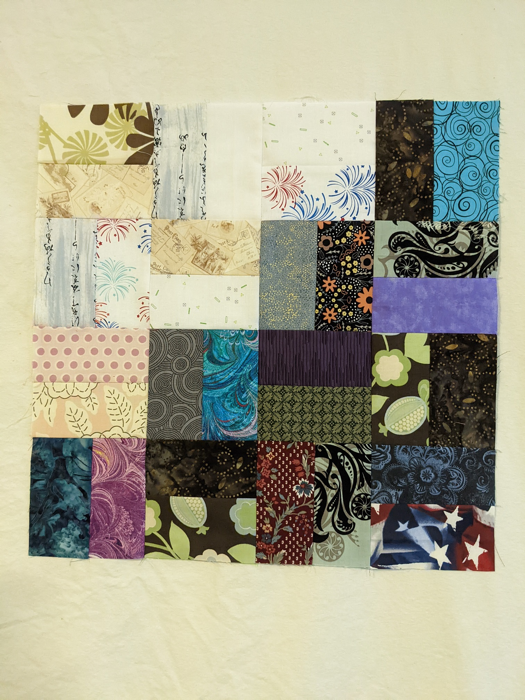
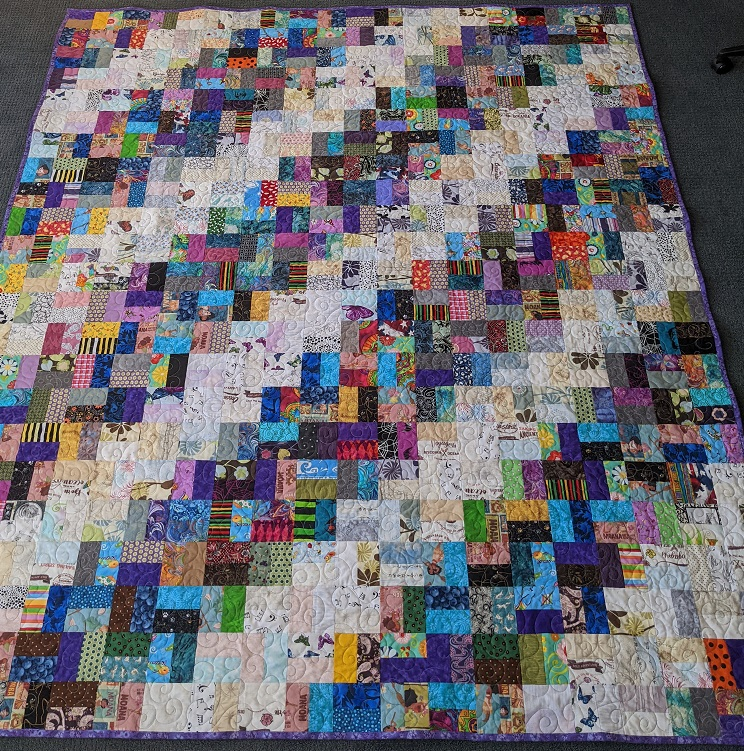
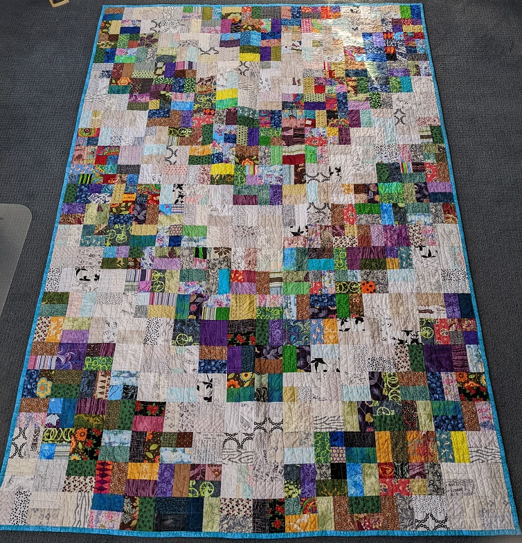

# Scrappy Quilt #1
FEBRUARY 2, 2022 BY KELLI

I am on a mission to use all (yes all) of my fabric to make quilts for charities. Since I have a lot of non-matching fabric, I decided to do scrappy quilts. This is my first block: 

As you can see, it's an arrangement of 2.5 x 4.5 inch bricks (scrap pieces). Match up 2 lights and 2 darks and when you have 6 light pairs and 10 dark pairs arrange them as shown above. This will make one 16.5" block (16" finished). 

Here are the two ways I've arranged these blocks:

I will try more arrangements with the next one. 
