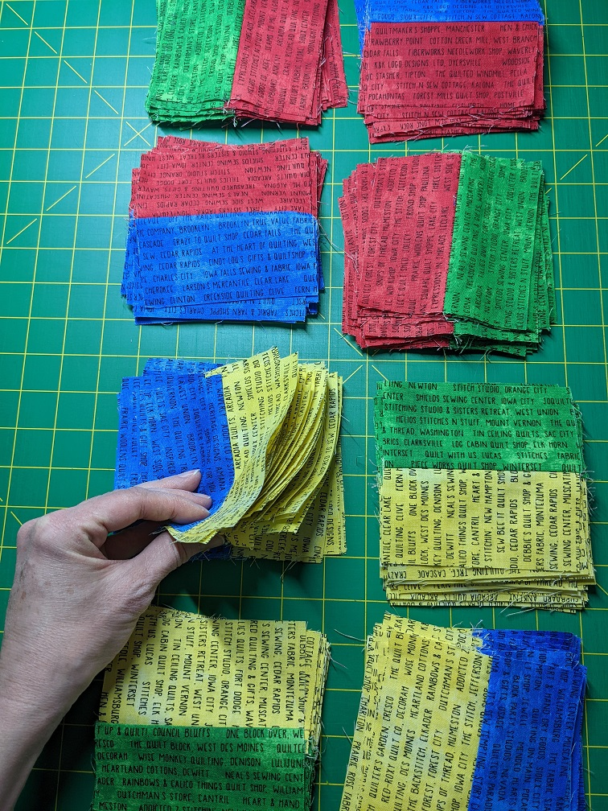
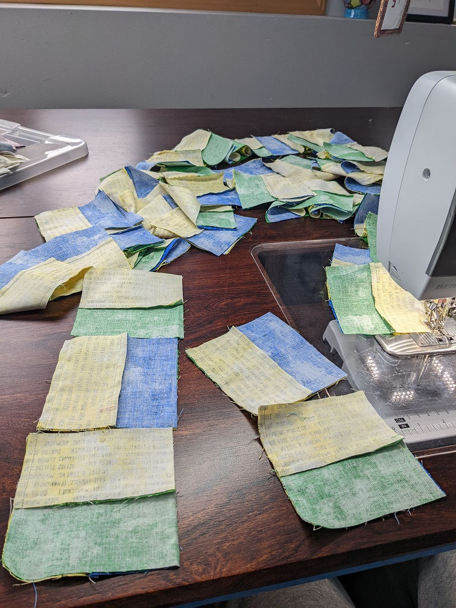

# Scrappy Quilt #2
FEBRUARY 2, 2022 BY KELLI

I was obsessed with "plus sign" (+) quilts. Except they seemed too fiddly for me to do quickly. All the colors had to be arranged one "plus sign" at a time. This sent me on a mission to create something that could be done faster. I started arranging my 2.5 x 4.5" bricks.

I found that if I limited my pallete to 4 colors I could make a very fast block that would give me free alternating plus signs. YAY! 

I found four 1 yard cuts of fabric and started making blocks. It was at this point that I realized there weren't actually mathmatical plus signs. Oops. 

But I was in too deep so I kept going. It really is just two different blocks:

And if you break that down even farther, it's 4 sub-blocks:

I whipped up a bunch of the blocks in my four color ways and stacked them to match my bigger block pattern:

You wouldn't have to do that, but it makes putting the blocks together really easy. I'd pull one piece off the top two piles and one each off the bottom two piles and push them through the sewing machine in order. 

When they come off the machine I keep the jump stiches between the two halves connected:

This way I can't flip one of them around on accident. I nest the center seams and push them through the machine again. It goes very quickly. 

This is what 4 yards of fabric can produce:

It wasn't enough to be a twin sized quilt, so I went back to my stash and guess what? I found two MORE yards of each color! Guess I was thinking ahead when I bought it back in 2019. 

P.S. Can you spot the rotated block? 
