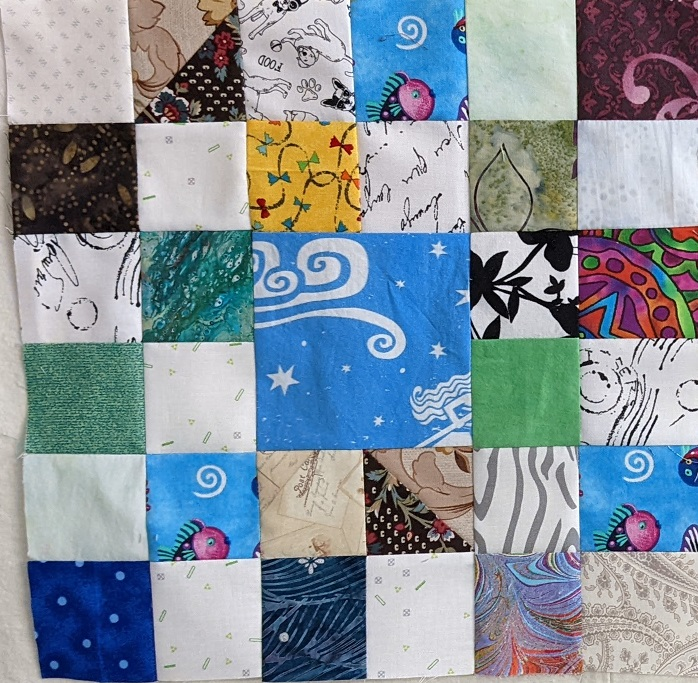

# Scrappy Quilt #3
FEBRUARY 9, 2022 BY KELLI

The January Guild newsletter brought a new request for blocks. This time it was a 4 patch of 2.5 x 2.5" blocks alternating light and dark. I was ready! Then they were going to put the four patches around a 4.5 x 4.5' block. I had that too! That block was alternated with a plainer block of light fabric surrounding a 4.5 x 4.5" block. Next thing I knew I had enough of those blocks to make a quilt. And using up the light fabric that I had a lot of, I'm on a roll now!

The next dilema was whether to put the blocks "on point" or not. I decided I liked the look of on point, but I'm not sure I'll do another one that way. It was a bit of a pain because then everything is on the bias. Quilting was evem harder because of the bias.  
