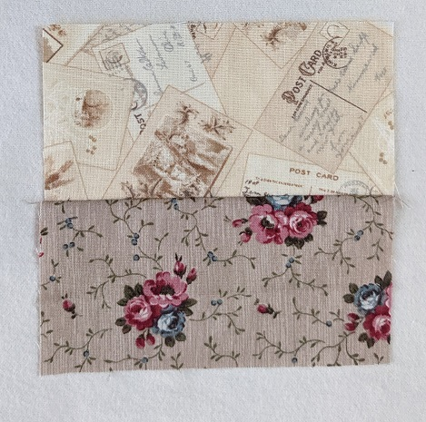
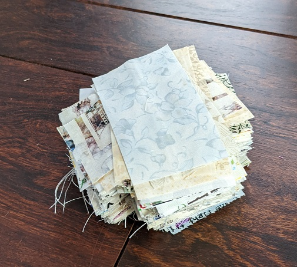

# Scraps
FEBRUARY 9, 2022 BY KELLI

I am on a mission to use all (yes all) of my fabric to make quilts for charities. Since I've collected a lot of non-matching fabric, I decided to do scrappy quilts. I've tried to get on the scrappy train a few times, but always failed. I finally realized it was because I did not have a plan or system. Well, now I do. 

I've followed [Bonnie Hunter](https://www.quiltville.com/index.html) for a long time. Bonnie is amazing and [she is where](https://quiltville.com/scrapusersystempf.html) I would like to get to some day. But, I needed to start smaller. Then my quilt guild sent out a request for blocks that became my [first scappy quilt](scrappy1). It was a perfect fit for me because I had decided to start creating my scraps in 3 sizes: 
- 2.5 x 2.5"
- 2.5 x 4.5" (brick)
- 4.5 x 4.5". 

These sizes work well together and I have already made several quilts from them. 

The other part of my system involves dividing the scraps between dark and light. Bonnie has a great discussion of dark and light [here](https://quiltville.blogspot.com/2013/03/focus-on-neutrals.html). Basically, it's subjective; you need to decide what your darkest light is and then go with it. I use this block as my guide, the top is light and the botton is dark. 

If I have a qustion about a fabric, I put it next to this block and stand back at least 10 feet and determine what the new fabric is based on how to looks next to this block. 

Someday I will expand my collect and start dividing the darks into color families like Bonnie and others do. But for now, dark and light is enough. 

The next part of the plan is the ender/leaders. I've decided that the block in my [first scrappy quilt](scrappy1) will be my default block. So, next to my sewing machine I have a stack of either light 2.5 x 4.5" bricks or dark ones.

Then any time I need to end a line of sewing I grab a pair and push it through. Then the block goes into the bin for 4.5 x 4.5" light squares. 

